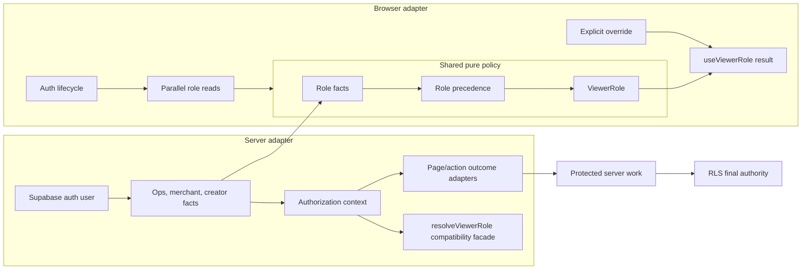

# Deepen the Ops Authorization Module

**Date:** 2026-08-08
**Status:** Approved
**Scope:** `apps/web` authorization helpers, role resolution, and tests

---

## 1. Overview

The Ops authorization path is already used broadly across the operator console, but its policy and data access are distributed across several helpers. Server guards perform their own authentication and role lookups, the merchant action guard performs an additional merchant-profile lookup, and the browser hook contains a parallel copy of the role-precedence policy.

This design deepens the module around one shared, pure role policy and separate server/browser data adapters. The change keeps the existing authorization contract intact while making the server guard path able to authenticate once, carry the merchant identity needed by merchant actions, and remain easy to test.

The design is intentionally additive. It does not change the database schema, RLS policies, RPCs, production data, or the authority boundary: server-side authorization and RLS remain the enforcement layers.

## 2. Current Context

The relevant code is concentrated in:

- `apps/web/lib/admin/guard.ts` — page and server-action guards.
- `apps/web/lib/auth/viewer-role.ts` — server-side `ViewerRole` resolution.
- `apps/web/lib/auth/useViewerRole.ts` — browser role lifecycle and lookup.
- `apps/web/tests/auth.viewer-role.test.ts` — server role-resolution coverage.
- `apps/web/tests/auth.useViewerRole.test.tsx` — browser lifecycle coverage.
- `apps/web/tests/admin.guard.test.ts` — page/action guard outcomes.

The effective role precedence is:

```text
active Ops member > merchant profile > active creator > signed-in traveler
```

An anonymous user resolves to `anon`. The `creator-pending` type remains part of the public role vocabulary, but the current resolver does not return it; this design does not introduce a new pending classification.

## 3. Goals

1. Make role precedence a single, pure policy shared by server and browser adapters.
2. Let server authorization read the authenticated user once per guard decision.
3. Carry the server-derived merchant profile ID with the authorization context so merchant actions do not repeat the profile lookup.
4. Preserve all current page, action, and browser lifecycle behavior.
5. Keep the authorization boundary explainable and testable without making the browser bundle depend on server-only code.
6. Make Ops authorization invariants explicit in focused tests.

## 4. Non-goals

- No change to `kinnso_ops_members`, `merchant_profiles`, or `creators` schema.
- No new RPC, migration, seed, deployment, or production-data operation.
- No RLS-policy redesign. RLS remains the final authority for database access.
- No new Ops role hierarchy or permission matrix. This remains the existing active-membership gate.
- No browser-side authorization of mutations.
- No broad migration of every direct `resolveViewerRole` caller in this change.

## 5. Authorization Contract to Preserve

### Role resolution

The shared policy must preserve these outcomes:

| Facts | Result |
|---|---|
| No authenticated user | `anon` |
| Active Ops membership, with or without lower-role records | `ops` |
| Merchant profile and no active Ops membership | `merchant` |
| Active creator and no higher-priority role | `creator` |
| Authenticated user without an active creator | `traveler` |

Role-read errors continue to behave as absent facts, matching the current data-only checks. No query error is treated as evidence of an active role, and this change does not introduce a different fail-open or fail-closed rule.

### Page guards

- Anonymous access redirects to the locale-specific sign-in route.
- An authenticated user without the required Ops role is handled through the existing `notFound` outcome.
- A successful Ops page decision returns the authenticated user.

### Action guards

- Anonymous and wrong-role decisions return the existing `formError` shape and message family.
- Successful Ops and creator decisions return `{ ok: true, user }`.
- Successful merchant decisions return `{ ok: true, user, merchantId }` using the server-derived profile ID.
- Traveler actions remain authentication-only and do not begin requiring a role lookup.

## 6. Proposed Architecture



### Shared policy module

Add a browser-safe module such as `apps/web/lib/auth/viewer-role-policy.ts`.

It owns only:

- the role vocabulary used by the existing app;
- the precedence rules;
- conversion of role facts into a `ViewerRole`.

It must not import Supabase clients, Next navigation APIs, React, or server-only modules. Its input is factual data supplied by an adapter; it performs no I/O and has no side effects.

### Server authorization context

Add a server-only context module such as `apps/web/lib/auth/authorization-context.ts`.

The context is responsible for:

- obtaining the authenticated user once;
- reading active Ops membership, merchant identity, and active-creator status using the current data sources;
- applying the shared policy;
- retaining the merchant profile ID when the merchant fact is present.

The context is a routing and caller-scoping aid, not a replacement for RLS. A caller that reaches a database write still depends on the existing RLS/RPC enforcement.

### Guard adapters

Refactor `apps/web/lib/admin/guard.ts` so the page and role-based action guards translate the context into their existing outcomes. The guards should not each reimplement authentication, role precedence, or merchant-profile lookup.

`requireTravelerAction` remains a small authentication-only guard because its current contract intentionally accepts any signed-in user.

### Compatibility facade

Keep `resolveViewerRole` as the supported role-only entry point for existing server callers. It delegates to the server context/policy path and preserves its existing return vocabulary and precedence. Existing page hosts and other direct callers can migrate independently in a later change.

### Browser adapter

Keep `apps/web/lib/auth/useViewerRole.ts` responsible for browser concerns:

- initial anonymous state;
- initial session lookup;
- auth-state subscription;
- parallel role-table reads;
- stale-resolution protection after auth changes;
- explicit role overrides for the existing UI/test use cases.

Replace only its local role-selection logic with the shared pure policy. The hook must not import the server context or any server-only dependency. An override remains a browser presentation/testing facility and must never influence server authorization.

## 7. Dependency and Error Semantics

The server decision flow is:

```text
auth.getUser()
  -> role facts + optional merchant ID
  -> shared precedence policy
  -> page/action outcome adapter
```

The server adapter may retain the current query ordering and data-access style; the required change is the single authenticated-user lookup and shared policy, not a database concurrency redesign. The browser adapter retains its current parallel reads.

If a role query returns no usable data or an error, that source contributes no active-role fact. The policy then evaluates the remaining facts using the existing precedence. This preserves current behavior while avoiding a new source of authorization success.

The merchant profile read supplies both the merchant role fact and the `merchantId` used by merchant actions. If a merchant action cannot obtain that ID, it returns the existing authorization failure rather than attempting to infer or accept a client-provided ID.

## 8. Security Invariants

The implementation must preserve these invariants:

- Ops access requires an active row in `kinnso_ops_members`.
- Ops remains the highest-priority role when multiple role records exist.
- Inactive or missing Ops membership never authorizes an Ops page or action.
- Browser role state is presentation-only; protected mutations continue through server guards and existing database enforcement.
- Merchant mutation scope is derived on the server and cannot be supplied by the browser role hook.
- RLS remains the final enforcement layer.
- Authorization decisions do not log sensitive user data or introduce side effects.

## 9. Testing Strategy

### Pure policy tests

Add a focused matrix for anonymous, Ops, merchant, active creator, traveler, mixed-role precedence, and absent/error-derived facts. Include the current effective behavior for the unused `creator-pending` vocabulary so the policy does not accidentally broaden the role contract.

### Server context and guard tests

Extend the server-side tests to verify:

- one authenticated-user lookup per context decision;
- active Ops precedence over merchant and creator records;
- inactive Ops membership is rejected;
- merchant context carries the expected profile ID;
- missing merchant identity returns the existing action failure;
- anonymous page redirect and unauthorized page `notFound` behavior remain unchanged;
- unauthorized actions retain the existing `formError` behavior;
- `requireTravelerAction` still accepts any authenticated user.

### Browser hook tests

Keep and adapt the existing coverage for initial anonymous state, active creator, merchant, Ops precedence, auth changes, stale signed-in lookups after sign-out, and explicit overrides. Add an assertion that the hook delegates selection to the shared policy rather than duplicating precedence locally.

### Regression surface

Run the focused authorization suites and the existing merchant action suites that depend on `merchantId`. Then run the repository's applicable typecheck, lint, and web test/build commands. Report focused tests, broader suite results, and any environment or external-provider blockers separately.

## 10. Migration Order

1. Add the pure policy module and its matrix tests.
2. Add the server authorization context and context tests.
3. Refactor the role-based guards to use the context while preserving their public outcomes.
4. Convert `resolveViewerRole` into the compatibility facade and keep its existing callers working.
5. Update `useViewerRole` to delegate role selection to the shared policy; retain its lifecycle implementation.
6. Update focused tests and merchant action regressions.
7. Run verification, review the diff for server/browser import boundaries, and stop before any database or production-data operation.

The migration is additive and reversible at the source level. No caller should need to change its authorization result or input contract during this sequence.

## 11. Acceptance Criteria

The design is implemented only when:

- all existing authorization outcomes remain compatible;
- the server guard path authenticates once per decision;
- merchant actions receive a server-derived `merchantId` without a duplicate profile lookup;
- server and browser role precedence comes from the same pure policy;
- browser lifecycle protections and overrides still pass;
- direct `resolveViewerRole` callers remain supported;
- no server-only import reaches the browser hook bundle;
- focused tests and applicable repository verification pass;
- no RLS, migration, RPC, seed, or production-data changes are introduced.

## 12. Design Decision

Use shared policy with separate data adapters. This provides one explainable role decision, removes server guard duplication, preserves the browser lifecycle boundary, and keeps RLS as the final authority without forcing a database or broad caller migration.
