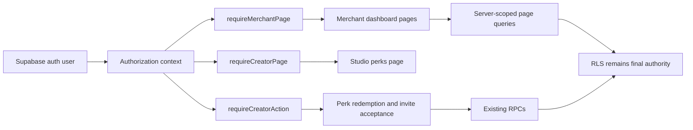

# Merchant and Creator Guard Consolidation

**Date:** 2026-08-09
**Status:** Approved
**Scope:** `apps/web` merchant and creator page/action authorization gates and regression tests

---

## 1. Overview

The authorization context now provides one server-derived role decision and, for merchants, the owning merchant profile ID. Several merchant dashboard pages still perform authentication and role checks inline, and two creator actions still duplicate the role-only check. This phase moves the high-confidence gates onto explicit page/action guard adapters while preserving each route's current outcome.

The change is intentionally narrow. It does not introduce a configurable generic page guard, migrate every direct `resolveViewerRole` caller, or alter the one creator insights route whose non-creator behavior is an intentional redirect to the studio hub.

## 2. Current Context

The relevant seams are:

- `apps/web/lib/auth/authorization-context.ts` — reads the authenticated user and role facts, then returns `{ user, role, merchantId }`.
- `apps/web/lib/admin/guard.ts` — the existing Ops, creator, merchant, and traveller action/page guard seam.
- `apps/web/lib/auth/viewer-role.ts` — compatibility role-only facade over the authorization context.
- `apps/web/lib/admin/result.ts` — typed action failure and `formError` contract.
- `apps/web/tests/admin.guard.test.ts` — focused guard contract coverage.

The current direct page gates are concentrated in eight merchant dashboard pages and the creator perks page. They generally follow this sequence:

```text
auth.getUser()
  -> anonymous redirect
  -> resolveViewerRole()
  -> role-specific notFound or redirect
  -> page data access
```

Because `resolveViewerRole()` delegates to the server authorization context, these pages currently perform a separate auth lookup before the role decision. Several merchant pages also read `merchant_profiles` again after the role check to obtain the merchant ID.

The two remaining direct creator action checks are:

- `apps/web/lib/perks/actions.ts::redeemPerkAction`
- `apps/web/lib/missions/invite-actions.ts::acceptInviteAction`

The stable action seam already used by merchant mutations is `requireMerchantAction`; the existing `requireCreatorAction` has the matching creator failure and success contract for these two actions.

## 3. Goals

1. Centralize the selected merchant and creator page gates behind explicit server guard functions.
2. Remove duplicate auth and role-check boilerplate from the eight merchant dashboard pages and creator perks page.
3. Reuse the server-derived `merchantId` for merchant-owned page queries where the page currently performs a second profile lookup.
4. Migrate the two direct creator action checks to `requireCreatorAction`.
5. Preserve current anonymous, wrong-role, missing-resource, and action-error outcomes.
6. Keep the guard API explainable and difficult to misuse.
7. Add focused regression coverage for guard outcomes, host pages, and action short-circuiting.

## 4. Non-goals

- No database schema, RLS policy, RPC, migration, seed, deployment, or production-data change.
- No new role, permission matrix, or role-precedence rule.
- No configurable `requireRolePage` abstraction with caller-selected denial behavior.
- No migration of every direct `resolveViewerRole` caller.
- No migration of `/studio/insights`; its non-creator-to-`/studio` redirect remains explicit.
- No change to the traveller authentication-only action contract.
- No replacement of RLS or RPC enforcement with application-level guards.

## 5. Authorization Contract to Preserve

### Merchant page guard

Add an explicit `requireMerchantPage(supabase, loc)` adapter with this contract:

| Context | Outcome |
|---|---|
| Anonymous | `redirect(\`/${loc}/sign-in\`)` |
| Authenticated non-merchant | `notFound()` |
| Merchant without a usable `merchantId` | `notFound()` |
| Merchant with a server-derived ID | `{ user, merchantId }` |

Ops remains a higher-priority role in the context, so an Ops user with lower-role records is not treated as a merchant page caller.

### Creator page guard

Add an explicit `requireCreatorPage(supabase, loc)` adapter with this contract:

| Context | Outcome |
|---|---|
| Anonymous | `redirect(\`/${loc}/sign-in\`)` |
| Authenticated non-creator | `notFound()` |
| Active creator | `{ user }` |

This adapter is used for `/studio/perks`. The `/studio/insights` route remains explicit because it intentionally redirects an authenticated non-creator to `/${loc}/studio`.

### Creator actions

`redeemPerkAction` and `acceptInviteAction` use `requireCreatorAction(supabase)` and return its existing `ActionFailure` unchanged when the caller is anonymous or not an active creator. Successful action behavior, RPC arguments, and revalidation paths remain unchanged.

### Merchant page data

The page guard's `merchantId` is authoritative for caller scoping. It may be passed to owner-RLS query helpers, but it is not a replacement for RLS or an assertion that the requested resource exists. Missing or non-owned resources continue to produce the page's existing `notFound()` outcome.

## 6. Proposed Architecture



### Explicit page adapters

The new adapters live beside the existing guards in `apps/web/lib/admin/guard.ts` and reuse `getAuthorizationContext`:

```ts
requireMerchantPage(
  supabase: Supabase,
  loc: Locale,
): Promise<{ user: { id: string }; merchantId: string }>

requireCreatorPage(
  supabase: Supabase,
  loc: Locale,
): Promise<{ user: { id: string } }>
```

They translate the shared context into route outcomes. They do not perform independent auth, role precedence, or merchant-profile lookups, and they do not accept role or merchant identity from callers.

### Page migration set

Migrate these merchant pages to `requireMerchantPage`:

- `apps/web/app/[locale]/merchants/dashboard/page.tsx`
- `apps/web/app/[locale]/merchants/dashboard/profile/page.tsx`
- `apps/web/app/[locale]/merchants/dashboard/creators/page.tsx`
- `apps/web/app/[locale]/merchants/dashboard/insights/page.tsx`
- `apps/web/app/[locale]/merchants/dashboard/experiences/page.tsx`
- `apps/web/app/[locale]/merchants/dashboard/experiences/new/page.tsx`
- `apps/web/app/[locale]/merchants/dashboard/experiences/[experienceId]/availability/page.tsx`
- `apps/web/app/[locale]/merchants/dashboard/experiences/[experienceId]/edit/page.tsx`

Migrate `apps/web/app/[locale]/studio/perks/page.tsx` to `requireCreatorPage`.

For the pages that currently query a merchant profile only to obtain its ID, use the guard result directly:

- experiences list uses `listMyExperiences(supabase, merchantId)`;
- experience edit and availability use `getMyExperience(supabase, merchantId, experienceId)`;
- creator discovery retains its tier read but keys it from the server-derived merchant ID.

The profile page continues to call `getMyMerchantProfile(supabase, user.id)` because it needs the complete profile payload. Dashboard home and new-experience pages may ignore the returned `merchantId`.

## 7. Dependency and Error Semantics

The migrated page flow is:

```text
createSupabaseServerClient()
  -> requireMerchantPage() or requireCreatorPage()
  -> page-specific data query
  -> existing rendering or notFound for absent data
```

Each guard decision obtains the authenticated user through one authorization-context call. The role facts continue to use the existing data sources and policy. No role-query error becomes an authorization success, and no client-supplied role or merchant ID is trusted.

The action flow is:

```text
createSupabaseServerClient()
  -> requireCreatorAction()
  -> existing RPC
  -> existing friendly error mapping and revalidation
```

The existing `ActionFailure` object is returned unchanged on an authorization failure, so callers retain the current `{ ok: false, errors }` shape and messages.

## 8. Security Invariants

- Merchant pages require the context's `merchant` role and a server-derived merchant profile ID.
- Creator pages and actions require an active creator according to the shared context policy.
- Ops users do not gain merchant or creator page access merely because lower-role records exist.
- Browser role state remains presentation-only.
- Merchant-owned reads remain protected by RLS and owner-scoped query predicates.
- Existing RPCs remain the authority for mutation authorization and business rules.
- No client-controlled identity or role value enters a guard decision.
- Authorization checks have no side effects and do not log sensitive user data.

## 9. Testing Strategy

### Guard unit tests

Extend `apps/web/tests/admin.guard.test.ts` with focused cases for:

- merchant page anonymous redirect;
- merchant page wrong-role `notFound`;
- merchant page success with the server-derived ID;
- merchant page defensive rejection when the role is merchant but the ID is absent;
- creator page anonymous redirect;
- creator page wrong-role `notFound`;
- creator page success.

Retain the existing Ops, creator-action, merchant-action, and traveller-action assertions.

### Page host regressions

Update the existing merchant dashboard/insights and studio perks/insights host tests to mock the new page guard seam where the imported page now depends on it. Keep assertions for:

- anonymous redirects;
- wrong-role `notFound` outcomes;
- creator perks rendering;
- merchant dashboard and insights rendering;
- existing route-specific redirect behavior for studio insights.

Add or extend focused host coverage for the migrated ownership pages if their guard result is used to replace a profile lookup. The tests should assert the correct merchant ID reaches the owned query helper rather than relying on a live database.

### Action regressions

Update `apps/web/tests/perks.actions.test.ts` and `apps/web/tests/missions.invite-actions.test.ts` to mock `requireCreatorAction`. Keep the pre-RPC rejection assertions and existing success/error mapping assertions. Add an explicit anonymous failure case if needed to distinguish the shared guard contract from role-only behavior.

### Verification

Run the focused authorization, merchant host, creator host, and action suites first. Then run the applicable web typecheck, lint, test/build, and `git diff --check` commands. Report source verification separately from any external-provider or environment gate.

## 10. Migration Order

1. Add and unit-test the explicit merchant and creator page adapters.
2. Migrate the two creator actions to the existing creator action guard.
3. Migrate the eight merchant pages and creator perks page, preserving route-specific outcomes.
4. Replace redundant merchant-profile ID reads only where the page guard already supplies the same server-derived identity.
5. Update focused host and action tests to the new guard seam.
6. Run focused and repository-level verification.
7. Review the diff for server-only import boundaries and stop before any database or production-data operation.

## 11. Acceptance Criteria

The implementation is complete only when:

- all migrated page and action outcomes remain compatible;
- merchant and creator page authorization flows through explicit context-backed adapters;
- the eight merchant dashboard pages no longer duplicate auth/role gate boilerplate;
- creator perks and the two creator actions no longer call `resolveViewerRole` directly;
- merchant-owned page queries use the server-derived `merchantId` where specified;
- `/studio/insights` retains its explicit non-creator redirect;
- focused guard, host, and action regressions pass;
- applicable typecheck, lint, test/build, and diff checks pass;
- no schema, RLS, RPC, migration, seed, deployment, or production-data changes are introduced.

## 12. Design Decision

Use explicit role-specific page adapters and the existing creator action adapter. This deepens the authorization module at the real server boundary, preserves route-specific denial semantics, carries trusted merchant identity to owned page queries, and avoids a generic option surface that could obscure security behavior.
